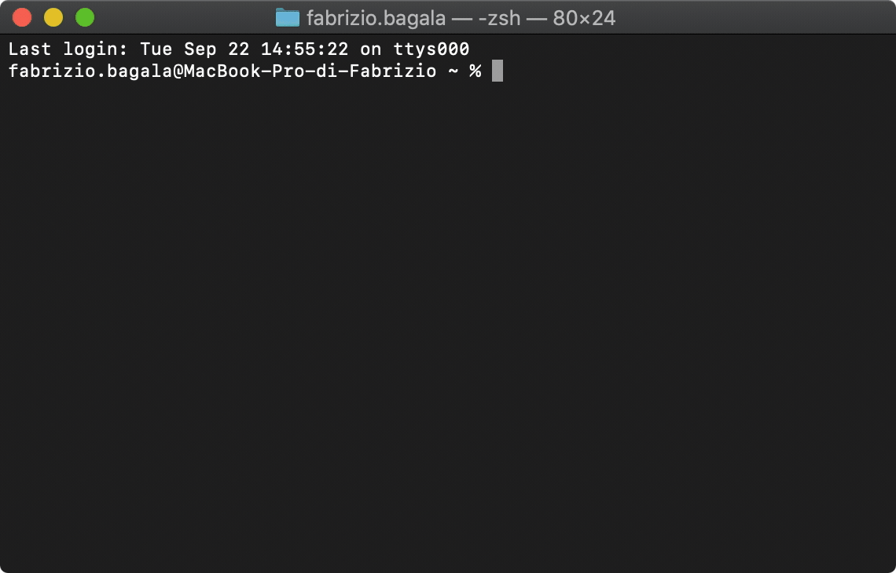
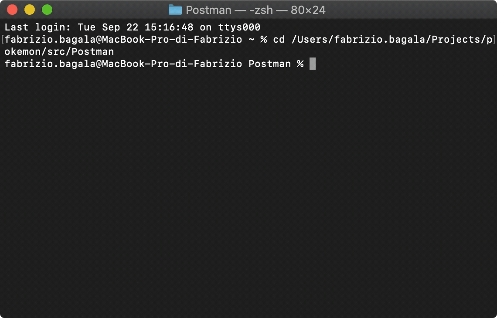

	

Pokemon is a REST API that given the name of a Pokemon returns its description in Shakespearean style.

## Prerequisites

On your machine must be installed:

- [.NET Core 3.1.402](https://dotnet.microsoft.com/) is a cross-platform version of .NET for building websites, services, and console apps.
- [Postman 7.32](https://www.postman.com/) is a collaboration platform for API development.
- [Node.js 14.11](https://nodejs.org/en/) is a JavaScript runtime built on Chrome's V8 JavaScript engine.
- [Newman 5.2.0](https://learning.postman.com/docs/running-collections/using-newman-cli/command-line-integration-with-newman/#:~:text=Newman%20is%20a%20command%20line,integration%20servers%20and%20build%20systems.) is a command line Collection Runner for Postman.
- [HTTPie 2.2.0](https://httpie.org/) is a user-friendly command-line HTTP client for the API era.

## Third-Party Libraries

The solution uses the following [Nuget](https://www.nuget.org/) packages:
- [Json.NET](https://www.newtonsoft.com/json) is a popular high-performance JSON framework for .NET.
- [Serilog](https://serilog.net/) provides diagnostic logging to files, the console, and elsewhere.
- [Moq](https://github.com/moq/moq4) is the most popular and friendly mocking library for .NET.

## Usage

Open the IDE and start the solution. The default browser will open with the following URL:

    http://localhost:5000/pokemon

If you see "All is OK", the application has started correctly; otherwise, consult the log file inside the Logs folder to check the issue.

Open the terminal and type the following command:

    http http://localhost:5000/pokemon/charizard

Example:

	

## API Design

#### Description

  Get Pokemon description in Shakespearean style about a specific Pokemon name.

  #### Request

    GET pokemon/{name}

  #### Path parameters

  | Name   | Type   | Required  | Description      | Example   |
  | :----: | :----: | :----:    | :---             | :----:    |
  | name   | string | yes       | The Pokemon name | charizard |

  #### Response

  | Code   | Description  | Media type | Example |
  | :----: | :---      | :---       | :---    |
  | 200    | Returned when successful | application/json | `{ "name": "charizard", "description": "Charizard flies 'round the sky in search of powerful opponents. 't breathes fire of such most wondrous heat yond 't melts aught. However,  't nev'r turns its fiery breath on any opponent weaker than itself." }` |
  | 404    | Returned when resource is not found | | |
  | 503    | Returned when the Fun Translations API is unavailable | | |

## Automated Testing

Open the IDE and start the solution.
 
Move to the directory containing the Postman collection.

    cd <repository_path>/src/Postman

Run the following command:

    newman run Pokemon_API.postman_collection.json

Example:

	

## License

Licensed under the [GNU General Public License v3.0](LICENSE) license.
